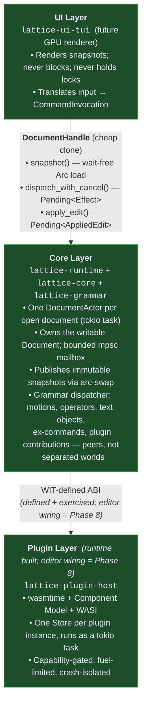

<p align="center">
	
</p>

A modal, GPU-accelerated, plugin-first text editor written in Rust. Combines
**vim's modal editing power** with **emacs's extensibility model** on a
non-blocking, multi-threaded core where the UI thread does no I/O, no parsing,
and no shaping.

> **Status:** Pre-1.0 / heavy development. Phases 0–3 are complete; Phase 4
> (LSP) is in wind-down (~90% shipped, 3 trigger-UX items deferred);
> **Phase 5 (GPU rendering + architectural asynchrony) is architecturally
> complete** — the Editor runs on its own dedicated thread with
> `&mut Editor` escape compile-time impossible (`EditorActorHandle`), both
> TUI and GPUI peers edit against a live rust-analyzer backend, and
> Phase 5.8 GPUI feature-parity work is the active frontier. Recent
> cross-cutting improvements: **two coding-agent integrations** — Claude Code
> (the `claude` CLI attaches over WebSocket/MCP, runs in a terminal buffer)
> and opencode (lattice drives `opencode acp` and owns the conversation as a
> buffer with modal-input prompt, interactive diff review, and a trust-mode
> toggle) — over one shared `EditorAccess` capability surface; a full diff &
> merge subsystem (inline / side-by-side / three-way, `]c` `[c` `do` `dp`,
> shared with the agents' edit review); O(viewport) incremental highlight +
> cell build (flat to 100k lines); soft-wrap on both renderers; event-driven
> TUI loop (100ms poll retired); decoration retention across focus changes
> (inactive panes keep full syntax/inlay/diagnostic set, proven zero-recompute
> on focus); multibuffer excerpt display; narrow mode (`zn`) with tree-sitter
> text objects (`af`/`ac`/`aa`/`al`/`aC`); operators that act on the Visual
> selection by design; and a multi-mode keybinding API.
> **Phase 7 (the WASM Component Model plugin host) is complete** — the
> `lattice-plugin-host` runtime, the `wit/` API package, the capability /
> fuel / crash-isolation model, and every extension seam (picker, grammar,
> completion, events, decorations, config, modes, host-services), each
> exercised end-to-end by a guest fixture, plus the `fuzzy-finder` validation
> plugin and CI overhead gates. **Editor-side loading** of plugins (the plugin
> manager, on-disk discovery, `init.rs`-as-WASM config) is **Phase 8** — the
> runtime is done; wiring it into the editor is next. See
> [`docs/dev/operations/implementation.md`](docs/dev/operations/implementation.md)
> for the per-feature ledger and [`docs/user/plugins.md`](docs/user/plugins.md)
> for the plugin model.

---

## Why another editor?

Three editors dominate today: Vim/Neovim (best modal editing, single-threaded
core, vimscript-only first-class config), Emacs (best extensibility, single-
threaded core, elisp-only first-class config), and VS Code (best plugin
ecosystem, web stack, latency dominated by Electron).

Lattice picks the strongest property from each and rebuilds them on a modern
foundation:

- **Strict vim grammar.** Counts, registers, operators, motions, text
  objects, ex-ranges, dot-repeat, marks, macros — semantics preserved
  exactly. The grammar is the public command API; the default keymap is a
  config file.
- **Emacs-class extensibility through WebAssembly.** Plugins are sandboxed
  WASM components: cross-language, capability-gated, fuel-limited,
  crash-isolated. A misbehaving plugin cannot freeze the editor.
- **Imperceptible input latency.** Keystroke → glyph indistinguishable from
  the terminal/compositor echoing the key — within one display frame under any
  background load, measured against the best-in-class reference and ratcheted
  by CI (it only gets faster). The UI thread never blocks. Multi-threaded by
  construction (one tokio task per document, snapshot-based render reads,
  bounded-mailbox dispatch).
- **GPU-accelerated rendering.** Sub-pixel-precise text, smooth scroll,
  layered paint paths optimized per content type (code vs. rich text vs.
  inline media). TUI is a first-class peer — not a throwaway.

The full design is in [`docs/dev/architecture/design.md`](docs/dev/architecture/design.md) (v0.6, ~3600 lines).

---

## Versus Zed

Vim/Emacs/VS Code above are the *feature* benchmarks. The closest *architectural*
peer is **Zed** — same substrate lineage (Rust, Tree-sitter, rope-backed, GPU via
**GPUI**, the framework Zed authored), and lattice borrows Zed's **multibuffer**
(excerpts from many buffers in one view). The remaining differences are
fundamental, not cosmetic:

| Axis | Lattice | Zed |
|---|---|---|
| **Editor ↔ UI** | Editor runs on its **own dedicated thread**; the renderer is a pure consumer of a published per-pane `DisplayMatrix`. `&mut Editor` escaping the actor is **compile-time impossible** | Editor state lives in GPUI's **entity graph on the main thread**; heavy work is offloaded to background executors |
| **Renderer** | `Renderer` trait — **TUI is a first-class peer** (headless / SSH) beside the GPUI peer; both consume the *same* `DisplayMatrix` | **GPU-only**; no headless / TUI path |
| **Editing model** | Strict **vim grammar IS the public command API**; motions / operators / text-objects are extensible from WASM | **Not modal by default** (Vim is a mode layer); core editing is fixed Rust |
| **Buffers** | **Everything is a buffer** — file tree, diagnostics, terminal, REPL — atop multibuffer | Multibuffer (excerpts), but file-tree / terminal are **bespoke panels** |
| **Extensibility** | WASM Component Model — **any language**, capability-gated, fuel-limited, crash-isolated | WASM extensions (languages / themes / slash-commands); core editing is not extensible at the grammar level |
| **Customization spine** | A feature **is a mode** that owns its keymaps, action-handler bodies, decorations, and subscriptions; the host is a thin substrate. Acid test: a new provider crate adds **zero** `Editor::` methods / host `Action` variants | Features are Rust **entities** wired through GPUI's entity graph; **Vim is a separate crate** layered over a non-modal core — modes are not the extension mechanism |
| **Collaboration** | None (single-user, deliberate scope) | **CRDT real-time multiplayer** — the rope is a CRDT; its headline feature |
| **Latency discipline** | keystroke→glyph **ratcheted in CI**; UI thread does **zero** I/O / parse / shape | GPU-smooth + SumTree for huge files; no public per-keystroke CI gate |

**What the differences buy — and cost:**

- **Lattice's bet is architectural rigidity *as a guarantee*.** The editor/renderer
  split is compile-time-enforced, so the UI literally cannot block on editor work
  (or vice-versa) and keystroke→glyph is bounded by construction, not by care.
  Everything-is-a-buffer makes one set of motions/commands work *uniformly*
  everywhere — the terminal is a real `Document`, so vim motions, search, marks,
  and text objects apply to it with no bespoke code. **Cost:** no collaboration
  story, younger and less polished, and the actor discipline adds ceremony to
  cross-feature data flow.
- **Lattice's bet is that the mode system *is* the extension mechanism.** A feature
  is a mode that owns its keymaps, action-handler bodies, decorations, and
  subscriptions; the host is a thin substrate with no per-feature branch (acid test:
  a new provider crate adds **zero** `Editor::` methods / host `Action` variants).
  Features therefore compose uniformly and a new one is a *crate*, not a host
  edit — where Zed's features are bespoke entities and Vim is a layer over a
  non-modal core. **Cost:** the host must stay disciplined-thin, and the recurring
  drift is the *half-migration* (keymap moved into the mode, handler left in the
  host), caught by tests rather than the type system.
- **Zed's bet is a shared entity graph + GPU polish + real-time collaboration.**
  Keeping editor state *with* the UI makes cross-feature data flow ergonomic and
  made CRDT multiplayer tractable; GPUI + SumTree deliver gorgeous, fast rendering
  on huge files. **Cost:** GPU is required (no SSH / headless), modal editing is a
  bolt-on rather than the core grammar, and core editing isn't user-extensible.

In one line: lattice aims for **Zed's substrate discipline + Neovim's grammar +
Emacs's extensibility model, with the UI-thread guarantee moved into the type
system** — at the explicit, current cost of Zed's collaboration and maturity.

The full architectural comparison — the mode-architecture deep-dive, the
honest assessment, and the one "decide early" item (CRDT-vs-rope, if
collaboration is ever in scope) — is in
[`docs/dev/architecture/comparison-zed.md`](docs/dev/architecture/comparison-zed.md).

> **Why not Helix here?** Helix shares Rust, Tree-sitter, and ropey, but those are
> substrate *libraries*, not architecture — and on everything that matters the two
> are opposite: vim verb-object grammar vs Helix's Kakoune-lineage selection-first
> model; config-as-code (WASM) vs TOML-only; plugin-first vs none-yet;
> actor-threaded vs single event-loop; GPU + TUI-peer vs TUI-only. It's a useful
> *contrast*, not an architectural peer.

---

## Paramount goals

In priority order when they conflict:

1. **Performance.** Imperceptible keystroke→glyph latency — match-or-beat
   the best-in-class reference, always within one display frame under load,
   ratcheted by CI (never regress; only gets faster). Per-call WASM overhead
   budgeted in CI (typed call < 500 ns p99; grammar-extension round-trip <
   5 µs p99).
2. **Extensibility.** WebAssembly Component Model plugin host from day one.
   WIT is the canonical API. Plugins ship in any language with
   component-model toolchain support (Rust, Zig, Go, AssemblyScript, …).
3. **Extensible vim modal editing.** Strict vim semantics. The grammar
   (operators, motions, text objects, registers, ranges, counts) IS the
   public command API. Adding new motions / text objects / operators is
   first-class — including future tree-sitter-driven variants.
4. **Asynchronicity.** Three-layer architecture (UI / Core / Plugins)
   communicating via typed message passing. Multi-threaded by construction.
   Each plugin instance owns its own `wasmtime::Store` and runs as a tokio
   task; many plugins execute in parallel across cores.

Three deliberate deviations from vim and emacs:

- **Unified command / grammar dispatch.** Vim's `:` ex-command world and
  the functional / plugin world are merged into one `CommandRegistry` with
  one dispatcher. The `:` line stays vim DSL (no function-call / palette
  syntax — explicit non-goal); plugins / `init.rs` / Rust callers
  construct `CommandInvocation` directly via the WIT host. Two input
  surfaces, one substrate. Every command is reachable from `:` via the
  kind-prefix form (`:motion goto-first-line`, `:operator delete word-
  forward`). (DESIGN.md §2.2 + §5.2.1.)
- **Everything is a buffer.** File tree, outline, diagnostics, search
  results, terminal, REPL — all are buffers placed by the user into panes
  via splits. The unified `BufferRegistry` already holds documents and
  file trees today; `:bn` / `:bp` / `:ls` / `:bd` work across kinds. No
  fixed sidebar or bottom-panel concept. (§5.9.)
- **One extension substrate, two config layers.** `options.toml` for static
  data; `init.rs` (compiled to WASM, auto-built on first boot, cached) for
  programmable config. `init.rs` is a plugin with `boot` capability — the
  same WIT, same toolchain, same host as third-party plugins. No vimscript,
  no elisp, no Lua, no embedded scripting language. See DESIGN.md §5.12.

---

## Architecture

Three layers, communicating only via typed messages and wait-free snapshot
loads:



### Crate map

| Crate                  | Purpose                                                                                                  | Status      |
|------------------------|----------------------------------------------------------------------------------------------------------|-------------|
| `lattice-protocol`     | Bottom-layer types: `Position`, `Range`, `Edit`, `Selection`, `CancellationToken`, `Event`, ID newtypes. | ✅ stable   |
| `lattice-core`         | `Buffer` (ropey-backed), `Document` with batched undo, file I/O, regex search (fancy-regex w/ backrefs). | ✅ stable   |
| `lattice-grammar`      | Vim modal state machine, `CommandRegistry`, dispatcher, built-in motions/operators/text objects/ex-cmds. | ✅ stable   |
| `lattice-runtime`      | `DocumentActor` + `DocumentHandle` (tokio task per doc), arc-swap snapshots, `Pending<T>`, event bus.    | ✅ stable   |
| `lattice-syntax`       | Tree-sitter integration (Rust / Python / JavaScript / Markdown bundled), incremental parse, highlights.  | ✅ stable   |
| `lattice-completion`   | Pluggable completion pipeline: generators, matchers, rankers, annotators.                                | ✅ stable   |
| `lattice-config`       | Typed-options registry (`OptionType` + `ArcSwap`-backed cells), `:set` parser, `gen:options` source.     | ✅ stable   |
| `lattice-mode`         | Major / minor mode trait surface, lifecycle events, mode registry, mode-async epoch.                     | ✅ stable   |
| `lattice-help`         | `HelpContent` + `HelpBuffer` + per-line markdown highlight cache; backing for `:help` and `:describe-*`. | ✅ stable   |
| `lattice-picker`       | Picker primitive: source registry, candidate batches, live-query subsystem, MRU frecency.                | ✅ stable   |
| `lattice-snippet`      | Snippet parser + registry; lazy expansion against `editor.snippet_registry` (ArcSwap).                   | ✅ stable   |
| `lattice-file-tree`    | File-tree buffer kind + per-buffer state types.                                                          | ✅ stable   |
| `lattice-oil`          | Oil-style directory buffer kind + state types.                                                           | ✅ stable   |
| `lattice-lsp`          | LSP client: actor pool, capability fingerprinting, diagnostics layer, supervisor, watcher subscriptions. | ✅ stable   |
| `lattice-cells`        | Pure data substrate for the cell-grid renderer: `CellMatrix`, `DisplayMatrix`, `VirtualRow`, display-slice iteration. No I/O, no rendering. | ✅ stable   |
| `lattice-multibuffer`  | Multibuffer data model, excerpt layout, major mode, motions, `<CR>` jump-to-source, header/fold virtual-row providers.          | 🚧 active   |
| `lattice-compilation`  | `:compile`/`:recompile`/`:make` runner, streaming `*compilation*` buffer + headerline, 4-parser tool-agnostic error list (stdout+stderr), `<CR>` jump / `<C-c>` kill, `*problems*` view. | 🚧 active   |
| `lattice-diff`         | Two-way and three-way hunk computation over `ropey::Rope` inputs (Histogram algorithm via `imara-diff`). Pure data; no I/O. | 🚧 active   |
| `lattice-terminal`     | Terminal emulator state machine + cell grid (`alacritty_terminal`). Backs the terminal buffer kind.     | 🚧 active   |
| `lattice-agent`        | The direction-independent agent capability surface: the `EditorAccess` port, the shared `review_diff` seam, per-process trace-log rings. Backs both agent integrations. | 🚧 active   |
| `lattice-ai`           | Agent adapters: opencode's native TUI in a terminal buffer (`opencode/` — `:opencode` + `opencode-mode`, the v1 path), the headless-ACP buffer conversation (`acp/` — `:opencode-acp`, kept for future IDE-native review), and Claude Code over MCP (`mcp/`). | 🚧 active   |
| `lattice-host`         | Renderer-agnostic substrate. Owns `Editor`, dispatch, mode lifecycle, options cascade, `RenderState`, `PerBufferCache`, LSP watcher task, cells/virtual-rows workers. | ✅ stable   |
| `lattice-ui-tui`       | Terminal UI peer: crossterm + ratatui, modal cursor, gutter, hlsearch, soft-wrap, command line, popups, picker UI. | ✅ stable   |
| `lattice-ui-gpui`      | GPU UI peer (feature `window`): GPUI + blade rendering. Full edit + LSP against rust-analyzer; Phase 5.8 feature-parity in progress. | 🚧 active   |
| `lattice-cli`          | Binary entry-point. `--tui` / `--gui` flag routes to either peer; tokio multi-thread main.               | ✅ stable   |
| `lattice-config-macros`| Proc-macro for typed-option / `OptionGroup` registration via `linkme` distributed slices.                | ✅ stable   |
| `lattice-plugin-api`   | Wasmtime-free plugin-API catalog derived from `wit/` at build time; backs `:describe-plugin-api` / `:list-plugin-apis` / `:export-plugin-api`. | ✅ stable   |
| `lattice-plugin-host`  | WASM Component Model host (wasmtime + WASI p2): capability/fuel/crash-isolation model + every extension seam. **Runtime complete (Phase 7); editor-side loading is Phase 8.** | ✅ built    |

---

## Quick start

**Requirements**

- Rust 1.94+ (edition 2024)
- A POSIX terminal that handles 256 colors and bracketed paste

**Build & run (TUI — default)**

```sh
# One-time (and after changing a core plugin): stage the bundled plugins.
# This builds e.g. auto-pair to wasm and drops it in ./runtime/plugins/, where
# the editor discovers it at boot. A released build ships these pre-staged.
cargo xtask build-core-plugins

cargo build --release
cargo run --release -- README.md
```

The CLI opens the file in the TUI. Editing is full vim modal, and **auto-pair is
on out of the box** (a *core plugin* — type `(` and get `()`). See
[`docs/user/core-plugins.md`](docs/user/core-plugins.md) to configure or disable
it, and [`docs/user/plugins.md`](docs/user/plugins.md) for the plugin model.
(`cargo xtask build-core-plugins` needs the `wasm32-wasip2` target:
`rustup target add wasm32-wasip2`.)

**Build & run (GPUI — GPU renderer)**

```sh
cargo xtask build-core-plugins   # once, as above
cargo run --release --features gui -- --gui README.md
```

Pass `--gui` to route to the GPUI peer. `--tui` explicitly forces the terminal
renderer. The two flags are mutually exclusive; the default stays TUI for direct
invocations.

**Configure (`init.rs`)**

```sh
lattice --scaffold-init   # scaffold a buildable starter config in ~/.config/lattice/init/
```

`init.rs` is your config *as code* — a WASM component (keymaps, options, event
handlers, custom commands). `--scaffold-init` writes a complete, buildable crate (with a
`wit/` copy of the editor's API); edit it, build to `wasm32-wasip2`, and
`:reload-config`. Static overrides can also go in `lattice.toml`. See
[`docs/user/init.md`](docs/user/init.md).

**macOS app bundle**

```sh
# Install once:
cargo install cargo-bundle

# Build the .app (must cd into the binary crate — cargo-bundle has no -p flag):
cd crates/lattice-cli
cargo bundle --release --features gui

# Open:
open ../../target/release/bundle/osx/Lattice.app
```

The bundle auto-routes to the GPUI renderer (no `--gui` flag needed) via
bundle-context detection: when the binary runs inside `…/Contents/MacOS/`, it
detects the `Contents` path component and selects GUI automatically. Pass
`--tui` to override. The icon comes from `assets/lattice.icns` (10 sizes,
16–512 px + @2x), configured in `[package.metadata.bundle]` in
`crates/lattice-cli/Cargo.toml`.

**Linux desktop entry**

```sh
sudo cp assets/linux/com.lattice-editor.lattice.desktop \
         /usr/share/applications/
sudo cp assets/favicon-64.png \
         /usr/share/icons/hicolor/64x64/apps/com.lattice-editor.lattice.png
gtk-update-icon-cache -f /usr/share/icons/hicolor/
```

**Run tests**

```sh
cargo test --workspace        # ~3748 tests, sub-second
cargo clippy --workspace      # workspace lints (deny unsafe outside opt-in)
```

**Run benchmarks**

```sh
cargo bench --workspace
```

Numbers are tracked in [`docs/dev/operations/benchmarks.md`](docs/dev/operations/benchmarks.md).

**Editor sanity tour**

In the running editor:

- `i a o O` — Insert / append / open below / open above
- `h j k l w b e gg G` — motions
- `dd 2dd dw daw diw` — delete with operators / counts / text objects
- `yy 2yy p P` — yank / paste
- `u <C-r>` — undo / redo (every operator lands as one undo unit)
- `Ctrl-V` then `Ij<Esc>` — block-visual insert; `>` indents block lines
- `/foo<CR> n N` — incremental search (regex with backrefs)
- `:%s/foo/bar/g` — substitute (`$1`, `${name}` template syntax)
- `:describe-command write` — every primitive carries help metadata
- `:motion goto-first-line` — invoke any motion / operator / text-object by name (chord grammar still preferred for typing)
- `:operator delete word-forward` — operator + bare target (motion / text-object resolved implicitly)
- `<C-w>v` then `<C-w>l` — split vertically and focus the right pane
- `:Tree .` (or `:e some-folder`) — open a folder as a file-tree buffer; `<CR>` toggles directories or opens files
- `:bn` / `:bp` / `:ls` / `:bd` — cycle, list, or close any open buffer (document or tree)
- `:set foldmethod=indent` — auto-fold indented blocks; `zo` / `zc` to open / close
- `:set wrap` — enable soft-wrap; long lines reflow at the pane width across both TUI and GPUI
- `:set ui.dim_inactive=off` — turn off the inactive-pane DIM overlay (inactive panes keep full syntax + inlay hints; only opacity changes)
- `:diffsplit other.rs` — side-by-side diff; `]c` / `[c` navigate hunks, `do` / `dp` transfer them; `:diffthis` / `:diff` for inline-vs-disk
- `:opencode` — launch the opencode agent's native TUI in a terminal buffer (its full interface: prompt, `/` commands, model switching, edit review), with `opencode-mode` for lattice navigation; `:opencode-acp` is the buffer-native alternative that reviews edits in lattice's diff view
- `:help` — open the topic index; `:help folding` / `:help buffers` / `:help opencode` for deep-dive docs (`<Tab>` completes)

---

## What distinguishes Lattice

Among modern editors built on Rust + GPU + tree-sitter + LSP + WASM (the only stack that hits sub-frame latency without compromising extensibility, and one Lattice shares with Zed deliberately), the differentiators are:

- **Vim grammar is the public command API**, not a key mapping over a non-modal core. One dispatcher; ex-commands, chords, and plugin contributions all flow through `CommandInvocation`. Adding a motion *is* extending the grammar.
- **Everything is a buffer, enforced**. File tree, diagnostics list, terminal, `*messages*`, scratch, even the **agent conversation** (`*ai:opencode*`, with a modal-input prompt tail) — all are buffers placed by the user into panes via splits. There is no sidebar / bottom-panel concept. Every text operation works on every buffer kind through one code path.
- **Modes own their surface; the host is a thin substrate**. A feature is a *mode* — it owns its keymaps (at `KeymapLayer::MinorMode` / `MajorMode`, never `Builtin`), the action-handler bodies those chords fire, its decorations, subscriptions, and completion sources. The host carries no per-feature branch; it exposes only generic primitives (buffer store, event bus, action-handler registry, chord dispatcher). The acid test is enforced: a new provider crate adds **zero** `Editor::` methods and **zero** host `Action` variants. This is the single deepest structural difference from Zed — lattice elevates *the mode system itself* to the extension mechanism, where Zed elevates the entity graph and treats modes as one feature layered over it. (DESIGN.md §5.8.2; `comparison-zed.md` §3.)
- **WIT is the canonical plugin API today** (not aspirationally). Any Component-Model language speaks the same protocol — Rust, Zig, Go, AssemblyScript. CI-gated overhead budgets (typed-call < 500 ns p99, grammar-extension round-trip < 5 µs p99).
- **Asynchrony is architectural, not disciplinary**. Other editors keep the UI thread free by convention — contributors know which calls might block. Lattice (DESIGN.md §5.7) chooses primitives that make UI-thread blocking *physically impossible* in the steady state: `RenderState` for reads, `Arc<ArcSwapOption<T>>` / `PerBufferCache<T>` for writes, dedicated subsystem tasks for everything else. The architecture stays uniform under feature pressure.

The detailed framing — what Lattice converges with Zed on, where it diverges deliberately, what we evaluated (Zed's `cx.notify()` reactive paint — assessed and deferred; the savings curve doesn't transfer to Lattice's cursor-coupled UI), and what we explicitly don't borrow (imposed layouts, custom rope, single-language extensions) — is in [DESIGN.md Appendix C](docs/dev/architecture/design.md).

---

## Performance commitments

Tracked against [DESIGN.md §8.2](docs/dev/architecture/design.md). Latest measured numbers in
[`docs/dev/operations/benchmarks.md`](docs/dev/operations/benchmarks.md):

| Commitment                   | Target (p99) | Status                                               |
|------------------------------|--------------|------------------------------------------------------|
| Keystroke → buffer mutation  | < 100 µs     | ✅ ~83 µs constant across buffer sizes               |
| Reflex motion / operator     | < 2 ms       | ✅ all under budget on 50k-line buffers              |
| Search (literal pattern)     | < 2 ms       | ✅ all variants under 2 ms on 200k-line buffers      |
| Snapshot load (renderer)     | < 5 ns       | ⚠️ ~17 ns (`load_full` Arc bump — known headroom)    |
| WASM typed call              | < 500 ns     | ✅ CI-gated (Phase 7); grammar round-trip < 5 µs (~340 ns release) |

The architectural rule: **the UI thread does no I/O, no parsing, no
shaping.** Document mutations route through the actor; renderers read
wait-free snapshots; cancellation is cooperative (Reflex commands observe a
flipped `CancellationToken` within ~100 µs).

---

## Roadmap

11 phases. The detailed status ledger is in
[`docs/dev/operations/implementation.md`](docs/dev/operations/implementation.md); the phase-level summary:

| Phase | Title                                  | Status      |
|-------|----------------------------------------|-------------|
| 0     | Foundation                             | ✅ done     |
| 1     | Modal Editing                          | ✅ done     |
| 2     | Terminal UI Bootstrap                  | ✅ done     |
| 3     | Tree-sitter (Rust / Python / JS / MD)  | ✅ done     |
| 4     | LSP                                    | 🚧 wind-down (~90% shipped; 3 trigger-UX items deferred: `linkedEditingRange`, `inlineValue`, `inlineCompletion`) |
| 5     | GPU Rendering + architectural async    | 🚧 architecturally complete (Editor on its own thread, compile-time enforced; both peers edit against live LSP). Phase 5.8 GPUI feature-parity is the active frontier. |
| 6     | Document Renderer + UI Components      | ✅ done (delivered across Phases 4–5) |
| 7     | Plugin Host (WASM Component Model)     | ✅ done (runtime — PH7.0–7.12; editor-side loading is Phase 8) |
| 8     | Major / Minor Modes + Reference Plugins| ⛔ planned (the plugin *manager*: loading, discovery, `init.rs`, modes-as-components) |
| 9     | Rich Buffer Rendering                  | ⛔ planned  |
| 10    | Polish + v1.0                          | ⛔ planned  |

### Detailed feature checklist

The granular pre-Phase-4 polish plan, plus the upcoming Phase 4 work:

**Async runtime + cancellation** (DESIGN.md §5.2, §5.6.8, §5.7)

- [x] `DocumentActor` + bounded-mailbox dispatch (one tokio task per doc)
- [x] `arc-swap` snapshot publish-before-reply contract
- [x] `Pending<T>` typed handles for every mutating call
- [x] Cooperative `CancellationToken` (grammar + actor + search loops)
- [x] Actor stress tests (mailbox saturation, concurrent senders, snapshot ordering)
- [ ] Per-`LatencyClass` deadline timers (Reflex < 2 ms, Display < 10 ms)
- [x] Plugin async-task host primitive (Phase 7 — per-plugin `Store` as a tokio task)

**Vim modal editing** (DESIGN.md §5.2)

- [x] Modal state machine: Normal / Insert / Visual / Op-pending / Command / Search / Replace
- [x] Strict vim grammar: counts, registers, operators, motions, text objects, ex-ranges
- [x] Built-in motion / operator / text-object catalog
- [x] Macros (recorded as `CommandInvocation` sequences, not keystrokes)
- [x] Marks, dot-repeat with insert-replay, position-history ring (§5.1.1)
- [x] Search + hlsearch with `fancy-regex` (RE2 + bounded NFA for backrefs)
- [x] Substitute (`:s` / `:%s`) with `$1` / `${name}` template syntax
- [x] Block-visual `d` / `y` / `c` / `I` / `A` / `>` / `<` (per-row dispatch + replicate-on-Esc + single undo unit)
- [x] Manual folds (`zf` / `zo` / `zc` / `za` / `zR` / `zM` / `zd`)
- [x] Counts on linewise ops (`2dd`, `2>>`) collapse to one undo unit
- [x] Substitute live preview (matches highlighted while typing `:s/pat/repl/...`)
- [x] Computed folds — indent fallback (`:set foldmethod=indent`); tree-sitter folds queued

**Unified command / grammar dispatch** (DESIGN.md §5.2.1)

- [x] One `CommandRegistry` for ex-commands, motions, operators, text objects
- [x] `:` line is a parser front-end producing typed `CommandInvocation`s
- [x] Every command is reachable from `:` via the kind-prefix form (`:motion goto-first-line`, `:operator delete word-forward`, `:text-object inner-word`); ex-commands keep their bare alias surface; chord grammar stays the natural compact-typing path
- [x] `:g/pat/body` and `:v/pat/body` parse `body` up front (no per-match re-parse)
- [x] `Range::Selection` resolves to active visual selection
- [x] Interactive arg-prompts via `args_schema` (any required arg arms a prompt; Chord kind auto-submits on next chord)

**Event system + hooks** (DESIGN.md §5.10)

- [x] Typed `Event` catalog in `lattice-protocol`
- [x] `EventBus`: `subscribe(filter, target)`, `unsubscribe`, `publish` (kind-indexed dispatch)
- [x] `SubscriptionTarget::Channel` (mpsc) and `SubscriptionTarget::Invocation`
- [ ] Actor publishes events on edit / save / mode-change
- [ ] `Before*`-event mutation / veto seam (formatters can rewrite content; `BeforeQuit` can abort)
- [ ] `:autocmd` and `add-hook` parser front-ends desugar to `subscribe`

**Self-documenting help** (DESIGN.md §5.11)

- [x] Every command / option / mode / keybinding carries metadata at registration time
- [x] `:describe-command`, `:describe-buffer`, `:describe-key`, `:keymap`, `:apropos`
- [x] `:describe-option`, `:options` (typed options registry)
- [x] `:help [topic]` -- free-form topic surface with `<Tab>` completion; built-ins embedded via `include_str!` from `docs/user/*.md`; `Dynamic` body variant is the seam for LSP / plugin-supplied topics; `:describe-*` views emit "See also" topic cross-links
- [ ] `:describe-event`, `:describe-mode` (each lands when its registry does)

**Configuration** (DESIGN.md §5.12)

- [x] **Renderer-agnostic typed-options crate** (`lattice-config`): `OptionType` trait with primitive impls (`bool`, `i64`, `String`); `Option<T>` with `ArcSwap<T>` value cell for wait-free reads; `OptionHandle<T>` for zero-overhead typed access; `ErasedOption` + `ConfigRegistry` for by-name lookups; `:set` parser; `gen:options` completion source — every consumer (App, plugins, future renderers) registers options through the same API
- [x] `register_core_options(&registry) → CoreOptions` for the nine renderer-agnostic options (`number`, `relativenumber`, `wrap`, `ignorecase`, `tabstop`, `foldenable`, `foldmethod`, `scrolloff`, `completion.auto_insert_single`)
- [x] Renderer-specific options register via the same API: `lattice-ui-tui::register_tui_options(&registry) → TuiOptions` covers `ui.dim_inactive`, `ui.separator`, `ui.separator_color`, `ui.statusline_active_fg`, `ui.statusline_inactive_fg`. Future GUI / web renderers register their own
- [x] `:set name=value`, `:set name`, `:set noname`, `:set name?` parser front-end (drives `ConfigRegistry::parse_and_set_command`)
- [x] `:describe-option <name>` (reads the erased view: name, aliases, type label, default, current value, enumerated values, doc)
- [ ] `options.toml` deserializer (static settings layer)
- [ ] `init.rs` plugin loader (Rust → WASM, auto-built on first boot, cached) — depends on Phase 7 plugin host
- [ ] Customize-as-buffer-view writes back to `options.toml`
- [ ] `lattice config build` diagnostic CLI subcommand
- [ ] Project-local `.lattice/options.toml` (project-local `init.rs` deferred behind a per-directory trust prompt)

**Rendering** (DESIGN.md §5.6)

- [x] TUI renderer (crossterm + ratatui) — first-class peer for headless / SSH
- [x] Display-width-aware cursor placement (CJK / Latin / emoji)
- [x] Tree-sitter highlight emission (Rust / Python / JS / Markdown bundled)
- [x] Markdown grammar with fenced-code injections (` ```rust``` ` blocks highlight as rust)
- [x] Markup `Style` variants for headings (1-6), bold / italic, links, raw — themable from day one
- [x] GPU compositor via GPUI — full edit + LSP parity with TUI on both renderers
- [x] O(viewport) incremental highlight + cell build (flat to 100k-line files; H-series)
- [x] Soft-wrap on both renderers: reflow at pane width, wrap-continuation gutter marker, wrapped cursor movement
- [x] Event-driven TUI loop — 100ms poll replaced by reader-thread + `Wake` channel; idle CPU ≈ 0
- [x] Decoration retention: inactive panes keep full syntax + inlay hints + diagnostics; focus change = opacity flip only, zero recompute
- [x] Per-pane `DisplayMatrix` (keyed by `PaneId`): shared produce/consume path for both active and inactive panes
- [ ] Renderer trait split (`EditorRenderer` / `DocumentRenderer` / `TuiRenderer`) — Phase 5/6
- [ ] Sprite atlas for icons (file-type, severity, gutter, picker, status) — §5.6.7
- [ ] Rich-buffer rendering (variable fonts within a single buffer) — Phase 9

**LSP** (DESIGN.md §5.4) — Phase 4 (wind-down)

- [x] Diagnostics, completion (Insert-mode + LSP source + docs popup + snippets + ghost text), hover (`K`), go-to-definition family (`gd`/`gD`/`gy`/`gI`), references (`gr`), symbols
- [x] Signature help, rename + prepareRename, code actions + execute, formatting (range / on-type / format-on-save)
- [x] Inlay hints, semantic tokens, document highlights, folding ranges, selection ranges
- [x] Call hierarchy, type hierarchy, document links, code lens, document colors
- [x] `window/showMessage`, `$/progress` modeline, `:lsp-restart`, dynamic `registerCapability` / `unregisterCapability`
- [x] Cancellation tokens plumbed through every wrapper; per-server compatibility shims
- [x] 15 sub-modes toggle individually or via the `lsp-mode` umbrella
- [ ] `linkedEditingRange` (needs shadow-edit machinery), `inlineValue` (needs DAP), `inlineCompletion` (lsp-types `proposed`) — deferred

**Plugin host** (DESIGN.md §5.5, §9) — Phase 7 ✅ (runtime; editor-side loading is Phase 8)

- [x] `wasmtime` + Component Model + WIT bindings; per-plugin `Store` as a tokio task
- [x] Module cache; capability manifests + WASI-preopen enforcement; fuel + epoch deadlines; crash-quarantine (`PluginCrashed`)
- [x] Per-call overhead bench gates in CI (grammar round-trip < 5 µs p99 ~340 ns; no-per-frame-WASM dep-graph guard; `wasm32-wasip2` in CI)
- [x] Every extension seam mirrored: picker, grammar (sync), completion, events, decorations, config, modes, host-services
- [x] Reference plugin: `fuzzy-finder` (validates picker primitive end-to-end; parity + overhead benched, not cut over)
- [ ] Editor-side loading: loader ex-command, on-disk plugin discovery, `init.rs`-as-WASM config — **Phase 8**

**Multi-buffer + UI components** (DESIGN.md §5.9) — Phase 6

- [x] Buffer abstraction + active-buffer routing; `<C-o>` / `<C-i>` walk across buffers
- [x] Pane tree + `<C-w>{s,v,c,h,j,k,l,w,W}` window-management chord grammar
- [x] Multiple Document buffers + `:bn` / `:bp` / `:ls` / `:bd` / `:b N`
- [x] File-tree buffer (`:Tree path`); multiple roots; `:e folder` defers to `:Tree folder`
- [x] Unified `BufferRegistry`: documents and trees in one keyspace; `BufferFlags { listed, hidden }`
- [x] Vim-style pane visuals: per-pane status line, `│` separator, inactive dim — all `:set ui.*`
- [x] Hover popup (LSP `K`); inline completion popup (vertico-style)
- [x] Multibuffer / excerpt display: `lattice-multibuffer` crate, excerpt layout, virtual-row header providers, composed→source row map, scrolling, generic `<CR>` jump-to-source
- [x] Compilation mode: `:compile`/`:recompile`/`:make` any CLI tool, streaming `*compilation*` + headerline, 4-parser tool-agnostic error list (stdout+stderr; cargo test panics), `:next-error`/`]qq`, `:error-list` picker, `*problems*` view, `<C-c>` kill
- [x] `*messages*` buffer (synthetic Document, subsystem-owned streaming content)
- [x] Pane groups (D.4) — foundation for diff side-by-side, `:set scrollbind`, `:windo`
- [x] Virtual rows + `DisplayMatrix` — above/below-anchored inlays, fold summaries, header rows
- [x] Diff foundation: two-way and three-way hunk computation; gutter diff signs; side-by-side diff layout (partial)
- [ ] Picker primitive as standalone buffer (file picker, project grep, diagnostics list — Phase 6)
- [ ] Oil buffer (directory editing à la vim-oil) — Phase 6
- [ ] Terminal buffer full PTY (T1 grid + snapshot landed; T2 color/input, T3 persistence — Phase 6)

**CI / engineering** (DESIGN.md §8)

- [x] Workspace lint policy (`unsafe_code = "deny"`, opt-in per module)
- [x] Criterion benches for runtime, motions, operators, search
- [x] Cross-platform CI matrix (Linux / macOS / Windows) + fmt + doc gates
- [x] Bench compile-check (catches bench-code rot per platform)
- [x] Bench baseline artifact recorded on every push to main
- [ ] Bench regression gate (needs stable runner; shared CI variance dwarfs signal)
- [ ] Allocation-discipline checks on the render hot path (dhat-based)

---

## Documentation

| Doc                                       | Purpose                                                  |
|-------------------------------------------|----------------------------------------------------------|
| [`docs/dev/guides/developing-lattice.md`](docs/dev/guides/developing-lattice.md) | **Start here to contribute** — dev loop, architecture mental model, mode-ownership, worked "add your first X" walkthroughs. |
| [`docs/dev/architecture/design.md`](docs/dev/architecture/design.md)        | The design spec (v0.6, authoritative for what to build). |
| [`docs/dev/operations/implementation.md`](docs/dev/operations/implementation.md) | Per-feature status ledger; the authoritative current-state record. |
| [`docs/dev/operations/benchmarks.md`](docs/dev/operations/benchmarks.md)| Latest measured numbers vs. §8.2 commitments.            |
| [`docs/dev/operations/verify.md`](docs/dev/operations/verify.md)        | Manual-verification checklist for recently shipped features. |
| [`docs/dev/architecture/lsp-architecture.md`](docs/dev/architecture/lsp-architecture.md) | LSP developer reference (companion to DESIGN.md §5.4). |
| [`docs/dev/notes/lsp-features.md`](docs/dev/notes/lsp-features.md) | Every LSP 3.17 capability + implementation status.  |
| [`docs/user/`](docs/user/)                | User-facing reference (the `:help`-style topic docs).    |
| [`CLAUDE.md`](CLAUDE.md)                  | Conventions for AI-assisted contributions.               |

When something disagrees, **DESIGN.md and IMPLEMENTATION.md are the
authoritative sources** for what should exist and what currently does.

---

## Contributing

The project is open to contributions, but please note the development model:

1. **The design doc is load-bearing.** Significant features need to land in
   `docs/dev/architecture/design.md` first (or be a refinement of an existing section). Open
   an issue describing the design rationale before sending a PR for
   non-trivial work.
2. **The four paramount goals override stylistic preferences when they
   conflict.** Performance, extensibility, vim semantics, asynchronicity —
   in that order.
3. **Commit history is the moving record.** Each commit is a complete unit
   (one feature / one fix / one refactor). Tests for new behavior land in
   the same commit.
4. **No backwards-compatibility shims for vim or emacs configs.** Explicit
   non-goal.
5. **Specific edge cases may be deferred for v1.** The semantics aren't
   altered, but rare register quirks or obscure block-visual behaviors can
   land post-1.0 with explicit tests documenting the gap.

### Good first issues

- Documenting a vim grammar primitive that's missing from
  `docs/dev/operations/implementation.md`'s catalog table.
- Adding a built-in motion / text object behind the existing
  `register_motion` / `register_text_object` API.
- Adding a tree-sitter grammar (look at how `lattice-syntax` wires Rust /
  Python / JS).
- Closing a §15 open question with a small design proposal.

### Development workflow

```sh
# Format + lint + test before pushing.
cargo fmt --all
cargo clippy --workspace --all-targets -- -D warnings
cargo test --workspace
```

The lint policy is workspace-wide: `unsafe_code = "deny"`. The search
module opts in via `#![allow(unsafe_code)]` for one specific
`from_utf8_unchecked` call on a streaming window — every other use must
document its invariant.

---

## License

Licensed under the [MIT License](LICENSE).

Unless you explicitly state otherwise, any contribution intentionally
submitted for inclusion in the work by you shall be licensed as above,
without any additional terms or conditions.

---

## Acknowledgements

The design draws on three editors that got things right:

- **Vim / Neovim** — the modal grammar (counts × operators × motions × text
  objects) is one of the great ideas in editor design. We adopt it
  wholesale.
- **Emacs** — the everything-is-a-buffer principle, the self-documenting
  help system, and the customize-as-buffer-view model are all here.
- **Zed** — the GPUI rendering stack is the same one Lattice uses, and the
  modern-Rust editor playbook (GPU rendering, tree-sitter, native LSP,
  WASM extensions) is shared on purpose. Where Lattice diverges
  deliberately — modal grammar as the public API, everything-is-a-buffer
  enforced, WIT as the canonical plugin interface, *architectural* (not
  disciplinary) async — is laid out in
  [DESIGN.md Appendix C](docs/dev/architecture/design.md).
