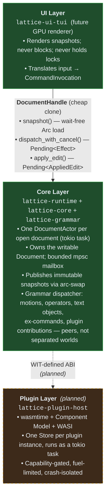

# Lattice

A modal, GPU-accelerated, plugin-first text editor written in Rust. Combines
**vim's modal editing power** with **emacs's extensibility model** on a
non-blocking, multi-threaded core where the UI thread does no I/O, no parsing,
and no shaping.

> **Status:** Pre-1.0 / heavy development. Phases 0–3 of the design roadmap
> are landed (foundation, modal engine, terminal UI, tree-sitter); the rest
> is in flight. The TUI is editable today; LSP, GPU rendering, and the WASM
> plugin host arrive in subsequent phases.

---

## Why another editor?

Three editors dominate today: Vim/Neovim (best modal editing, single-threaded
core, vimscript-only first-class config), Emacs (best extensibility, single-
threaded core, elisp-only first-class config), and VS Code (best plugin
ecosystem, web stack, latency dominated by Electron).

Lattice picks the strongest property from each and rebuilds them on a modern
foundation:

- **Strict vim grammar.** Counts, registers, operators, motions, text
  objects, ex-ranges, dot-repeat, marks, macros — semantics preserved
  exactly. The grammar is the public command API; the default keymap is a
  config file.
- **Emacs-class extensibility through WebAssembly.** Plugins are sandboxed
  WASM components: cross-language, capability-gated, fuel-limited,
  crash-isolated. A misbehaving plugin cannot freeze the editor.
- **Sub-frame input latency.** Keystroke → glyph in <8 ms at 120 Hz. The UI
  thread never blocks. Multi-threaded by construction (one tokio task per
  document, snapshot-based render reads, bounded-mailbox dispatch).
- **GPU-accelerated rendering.** Sub-pixel-precise text, smooth scroll,
  layered paint paths optimized per content type (code vs. rich text vs.
  inline media). TUI is a first-class peer — not a throwaway.

The full design is in [`docs/DESIGN.md`](docs/DESIGN.md) (v0.4, ~2300 lines).

---

## Paramount goals

In priority order when they conflict:

1. **Performance.** Sub-frame input latency. Per-call WASM overhead
   budgeted in CI (typed call < 500 ns p99; grammar-extension round-trip <
   5 µs p99).
2. **Extensibility.** WebAssembly Component Model plugin host from day one.
   WIT is the canonical API. Plugins ship in any language with
   component-model toolchain support (Rust, Zig, Go, AssemblyScript, …).
3. **Extensible vim modal editing.** Strict vim semantics. The grammar
   (operators, motions, text objects, registers, ranges, counts) IS the
   public command API. Adding new motions / text objects / operators is
   first-class — including future tree-sitter-driven variants.
4. **Asynchronicity.** Three-layer architecture (UI / Core / Plugins)
   communicating via typed message passing. Multi-threaded by construction.
   Each plugin instance owns its own `wasmtime::Store` and runs as a tokio
   task; many plugins execute in parallel across cores.

Three deliberate deviations from vim and emacs:

- **Unified command / grammar dispatch.** Vim's `:` ex-command world and
  the functional / plugin world are merged into one `CommandRegistry` with
  one dispatcher. The `:`-line is a parser front-end. (DESIGN.md §5.2.1.)
- **Everything is a buffer.** File tree, outline, diagnostics, search
  results, terminal, REPL — all are buffers placed by the user into panes.
  No fixed sidebar or bottom-panel concept. (§5.9.)
- **TOML config + WASM extensions.** No vimscript, no elisp, no Lua. One
  extension substrate.

---

## Architecture

Three layers, communicating only via typed messages and wait-free snapshot
loads:



### Crate map

| Crate                | Purpose                                                                                                    | Status     |
|----------------------|------------------------------------------------------------------------------------------------------------|------------|
| `lattice-protocol`   | Bottom-layer types: `Position`, `Range`, `Edit`, `Selection`, `CancellationToken`, `Event`, ID newtypes.   | ✅ stable  |
| `lattice-core`       | `Buffer` (ropey-backed), `Document` with batched undo, file I/O, regex search (fancy-regex w/ backrefs).   | ✅ stable  |
| `lattice-grammar`    | Vim modal state machine, `CommandRegistry`, dispatcher, built-in motions/operators/text objects/ex-cmds.  | ✅ stable  |
| `lattice-completion` | Pluggable completion pipeline: generators, matchers, rankers, annotators.                                  | ✅ stable  |
| `lattice-syntax`     | Tree-sitter integration (Rust / Python / JavaScript bundled), incremental parse, highlight emission.       | ✅ stable  |
| `lattice-runtime`    | `DocumentActor` + `DocumentHandle` (tokio task per doc), arc-swap snapshots, `Pending<T>`, event bus.      | ✅ stable  |
| `lattice-ui-tui`     | Terminal UI: crossterm + ratatui, modal cursor, gutter, hlsearch, command line, help overlay.              | ✅ stable  |
| `lattice-cli`        | Binary entry-point. Spawns the TUI runtime against a document.                                             | ✅ stable  |
| `lattice-render`     | GPU rendering foundation (GPUI preferred, wgpu fallback). **Planned (Phase 5).**                           | ⛔ planned |
| `lattice-plugin-host`| WASM Component Model host. **Planned (Phase 7).**                                                          | ⛔ planned |

---

## Quick start

**Requirements**

- Rust 1.94+ (edition 2024)
- A POSIX terminal that handles 256 colors and bracketed paste

**Build & run**

```sh
cargo build --release
cargo run --release -- README.md
```

The CLI opens the file in the TUI. Editing is full vim modal.

**Run tests**

```sh
cargo test --workspace        # ~1099 tests, sub-second
cargo clippy --workspace      # workspace lints (deny unsafe outside opt-in)
```

**Run benchmarks**

```sh
cargo bench --workspace
```

Numbers are tracked in [`docs/BENCHMARKS.md`](docs/BENCHMARKS.md).

**Editor sanity tour**

In the running editor:

- `i a o O` — Insert / append / open below / open above
- `h j k l w b e gg G` — motions
- `dd 2dd dw daw diw` — delete with operators / counts / text objects
- `yy 2yy p P` — yank / paste
- `u <C-r>` — undo / redo (every operator lands as one undo unit)
- `Ctrl-V` then `Ij<Esc>` — block-visual insert; `>` indents block lines
- `/foo<CR> n N` — incremental search (regex with backrefs)
- `:%s/foo/bar/g` — substitute (`$1`, `${name}` template syntax)
- `:describe-command write` — every primitive carries help metadata

---

## Performance commitments

Tracked against [DESIGN.md §8.2](docs/DESIGN.md). Latest measured numbers in
[`docs/BENCHMARKS.md`](docs/BENCHMARKS.md):

| Commitment                   | Target (p99) | Status                                               |
|------------------------------|--------------|------------------------------------------------------|
| Keystroke → buffer mutation  | < 100 µs     | ✅ ~83 µs constant across buffer sizes               |
| Reflex motion / operator     | < 2 ms       | ✅ all under budget on 50k-line buffers              |
| Search (literal pattern)     | < 2 ms       | ✅ all variants under 2 ms on 200k-line buffers      |
| Snapshot load (renderer)     | < 5 ns       | ⚠️ ~17 ns (`load_full` Arc bump — known headroom)    |
| WASM typed call (planned)    | < 500 ns     | ⛔ Phase 7                                           |

The architectural rule: **the UI thread does no I/O, no parsing, no
shaping.** Document mutations route through the actor; renderers read
wait-free snapshots; cancellation is cooperative (Reflex commands observe a
flipped `CancellationToken` within ~100 µs).

---

## Roadmap

11 phases. The detailed status ledger is in
[`docs/IMPLEMENTATION.md`](docs/IMPLEMENTATION.md); the phase-level summary:

| Phase | Title                                  | Status      |
|-------|----------------------------------------|-------------|
| 0     | Foundation                             | ✅ done     |
| 1     | Modal Editing                          | ✅ done     |
| 2     | Terminal UI Bootstrap                  | ✅ done     |
| 3     | Tree-sitter (Rust / Python / JS)       | ✅ done     |
| 4     | LSP                                    | 🔜 next    |
| 5     | GPU Rendering Foundation               | ⛔ planned  |
| 6     | Document Renderer + UI Components      | ⛔ planned  |
| 7     | Plugin Host (WASM Component Model)     | ⛔ planned  |
| 8     | Major / Minor Modes + Reference Plugins| ⛔ planned  |
| 9     | Rich Buffer Rendering                  | ⛔ planned  |
| 10    | Polish + v1.0                          | ⛔ planned  |

### Detailed feature checklist

The granular pre-Phase-4 polish plan, plus the upcoming Phase 4 work:

**Async runtime + cancellation** (DESIGN.md §5.2, §5.6.8, §5.7)

- [x] `DocumentActor` + bounded-mailbox dispatch (one tokio task per doc)
- [x] `arc-swap` snapshot publish-before-reply contract
- [x] `Pending<T>` typed handles for every mutating call
- [x] Cooperative `CancellationToken` (grammar + actor + search loops)
- [x] Actor stress tests (mailbox saturation, concurrent senders, snapshot ordering)
- [ ] Per-`LatencyClass` deadline timers (Reflex < 2 ms, Display < 10 ms)
- [ ] Plugin async-task host primitive (Phase 7)

**Vim modal editing** (DESIGN.md §5.2)

- [x] Modal state machine: Normal / Insert / Visual / Op-pending / Command / Search / Replace
- [x] Strict vim grammar: counts, registers, operators, motions, text objects, ex-ranges
- [x] Built-in motion / operator / text-object catalog
- [x] Macros (recorded as `CommandInvocation` sequences, not keystrokes)
- [x] Marks, dot-repeat with insert-replay, position-history ring (§5.1.1)
- [x] Search + hlsearch with `fancy-regex` (RE2 + bounded NFA for backrefs)
- [x] Substitute (`:s` / `:%s`) with `$1` / `${name}` template syntax
- [x] Block-visual `d` / `y` / `c` / `I` / `A` / `>` / `<` (per-row dispatch + replicate-on-Esc + single undo unit)
- [x] Manual folds (`zf` / `zo` / `zc` / `za` / `zR` / `zM` / `zd`)
- [x] Counts on linewise ops (`2dd`, `2>>`) collapse to one undo unit
- [x] Substitute live preview (matches highlighted while typing `:s/pat/repl/...`)
- [ ] Computed folds (tree-sitter + indent fallback)

**Unified command / grammar dispatch** (DESIGN.md §5.2.1)

- [x] One `CommandRegistry` for ex-commands, motions, operators, text objects
- [x] `:` line is a parser front-end producing typed `CommandInvocation`s
- [x] `:g/pat/body` and `:v/pat/body` parse `body` up front (no per-match re-parse)
- [x] `Range::Selection` resolves to active visual selection
- [x] Interactive arg-prompts via `args_schema` (any required arg arms a prompt; Chord kind auto-submits on next chord)

**Event system + hooks** (DESIGN.md §5.10)

- [x] Typed `Event` catalog in `lattice-protocol`
- [x] `EventBus`: `subscribe(filter, target)`, `unsubscribe`, `publish` (kind-indexed dispatch)
- [x] `SubscriptionTarget::Channel` (mpsc) and `SubscriptionTarget::Invocation`
- [ ] Actor publishes events on edit / save / mode-change
- [ ] `Before*`-event mutation / veto seam (formatters can rewrite content; `BeforeQuit` can abort)
- [ ] `:autocmd` and `add-hook` parser front-ends desugar to `subscribe`

**Self-documenting help** (DESIGN.md §5.11)

- [x] Every command / option / mode / keybinding carries metadata at registration time
- [x] `:describe-command`, `:describe-buffer`, `:describe-key`, `:keymap`, `:apropos`
- [ ] `:describe-option`, `:describe-event`, `:describe-mode` (each lands when its registry does)

**Configuration** (DESIGN.md §5.12)

- [ ] Typed options registry: `name, type, default, doc, group, validator`
- [ ] `:set name=value` parser front-end
- [ ] Customize-as-buffer-view writes back to user TOML

**Rendering** (DESIGN.md §5.6)

- [x] TUI renderer (crossterm + ratatui) — first-class peer for headless / SSH
- [x] Display-width-aware cursor placement (CJK / Latin / emoji)
- [x] Tree-sitter highlight emission (Rust / Python / JS bundled)
- [ ] GPU compositor (GPUI preferred, wgpu fallback) — Phase 5
- [ ] `EditorRenderer` + `DocumentRenderer` + `TuiRenderer` trait split — Phase 5/6
- [ ] Sprite atlas for icons (file-type, severity, gutter, picker, status) — §5.6.7
- [ ] Rich-buffer rendering (variable fonts within a single buffer) — Phase 9

**LSP** (DESIGN.md §5.4) — Phase 4

- [ ] Diagnostics, completion, hover, go-to-definition, references
- [ ] Cancellation (uses the cancellation-token plumbing already in place)
- [ ] Per-server compatibility shims

**Plugin host** (DESIGN.md §5.5, §9) — Phase 7

- [ ] `wasmtime` + Component Model + WIT bindings
- [ ] AOT module cache; lazy instantiation; capability manifests; fuel limits
- [ ] Per-call overhead bench gates in CI (typed call < 500 ns p99; round-trip < 5 µs p99)
- [ ] Reference plugin: `fuzzy-finder` (validates picker primitive end-to-end)

**Multi-buffer + UI components** (DESIGN.md §5.9) — Phase 6

- [ ] Multi-buffer foundations (the trigger for `HelpDisplayMode` beyond `Popup`)
- [ ] Pane tree + split / window operations
- [ ] Picker primitive (file picker as first user)
- [ ] Hover popup; inline completion popup
- [ ] Buffer-backed views: file-tree, outline, diagnostics-list, scratch, messages, compilation

**CI / engineering** (DESIGN.md §8)

- [x] Workspace lint policy (`unsafe_code = "deny"`, opt-in per module)
- [x] Criterion benches for runtime, motions, operators, search
- [x] Cross-platform CI matrix (Linux / macOS / Windows) + fmt + doc gates
- [x] Bench compile-check (catches bench-code rot per platform)
- [x] Bench baseline artifact recorded on every push to main
- [ ] Bench regression gate (needs stable runner; shared CI variance dwarfs signal)
- [ ] Allocation-discipline checks on the render hot path (dhat-based)

---

## Documentation

| Doc                                       | Purpose                                                  |
|-------------------------------------------|----------------------------------------------------------|
| [`docs/DESIGN.md`](docs/DESIGN.md)        | The design spec (v0.4, authoritative for what to build). |
| [`docs/IMPLEMENTATION.md`](docs/IMPLEMENTATION.md) | Per-feature status ledger; updated per session.   |
| [`docs/BENCHMARKS.md`](docs/BENCHMARKS.md)| Latest measured numbers vs. §8.2 commitments.            |
| [`docs/VERIFY.md`](docs/VERIFY.md)        | Manual-verification checklist for recently shipped features. |
| [`CLAUDE.md`](CLAUDE.md)                  | Conventions for AI-assisted contributions.               |

When something disagrees, **DESIGN.md and IMPLEMENTATION.md are the
authoritative sources** for what should exist and what currently does.

---

## Contributing

The project is open to contributions, but please note the development model:

1. **The design doc is load-bearing.** Significant features need to land in
   `docs/DESIGN.md` first (or be a refinement of an existing section). Open
   an issue describing the design rationale before sending a PR for
   non-trivial work.
2. **The four paramount goals override stylistic preferences when they
   conflict.** Performance, extensibility, vim semantics, asynchronicity —
   in that order.
3. **Commit history is the moving record.** Each commit is a complete unit
   (one feature / one fix / one refactor). Tests for new behavior land in
   the same commit.
4. **No backwards-compatibility shims for vim or emacs configs.** Explicit
   non-goal.
5. **Specific edge cases may be deferred for v1.** The semantics aren't
   altered, but rare register quirks or obscure block-visual behaviors can
   land post-1.0 with explicit tests documenting the gap.

### Good first issues

- Documenting a vim grammar primitive that's missing from
  `docs/IMPLEMENTATION.md`'s catalog table.
- Adding a built-in motion / text object behind the existing
  `register_motion` / `register_text_object` API.
- Adding a tree-sitter grammar (look at how `lattice-syntax` wires Rust /
  Python / JS).
- Closing a §15 open question with a small design proposal.

### Development workflow

```sh
# Format + lint + test before pushing.
cargo fmt --all
cargo clippy --workspace --all-targets -- -D warnings
cargo test --workspace
```

The lint policy is workspace-wide: `unsafe_code = "deny"`. The search
module opts in via `#![allow(unsafe_code)]` for one specific
`from_utf8_unchecked` call on a streaming window — every other use must
document its invariant.

---

## License

Licensed under the [MIT License](LICENSE).

Unless you explicitly state otherwise, any contribution intentionally
submitted for inclusion in the work by you shall be licensed as above,
without any additional terms or conditions.

---

## Acknowledgements

The design draws on three editors that got things right:

- **Vim / Neovim** — the modal grammar (counts × operators × motions × text
  objects) is one of the great ideas in editor design. We adopt it
  wholesale.
- **Emacs** — the everything-is-a-buffer principle, the self-documenting
  help system, and the customize-as-buffer-view model are all here.
- **Zed** — the GPUI rendering stack and the discipline of keeping the UI
  thread free of work above 8 ms is the bar we're shooting at.
