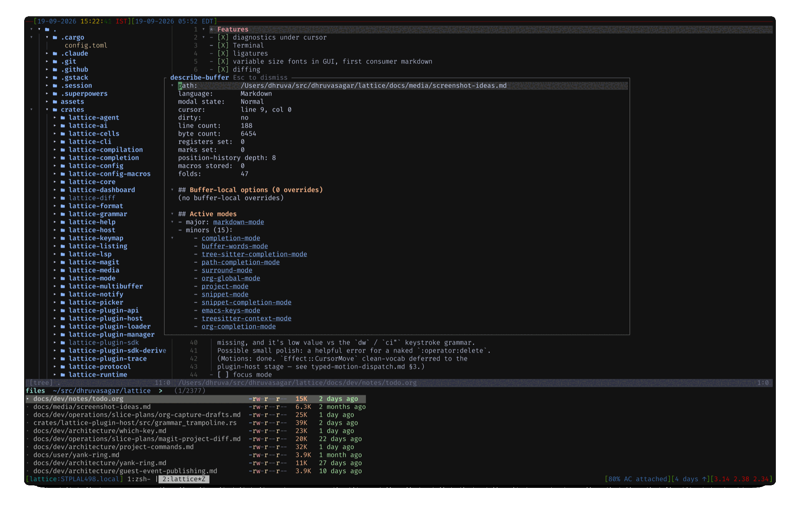

<p align="center">
	
</p>

<p align="center">
	A modal, GPU-accelerated, plugin-first text editor written in Rust.
	Combines <strong>vim's modal editing power</strong> with
	<strong>emacs's extensibility model</strong> on a non-blocking,
	multi-threaded core.
</p>

<p align="center">
	
</p>

> **0.9 — alpha.** The editor is usable; the distribution is new. Expect
> rough edges in install and first-run rather than in editing. Please file
> what you hit: [issues](https://github.com/dhruvasagar/lattice/issues).

## Install

```sh
curl -fsSL https://raw.githubusercontent.com/dhruvasagar/lattice/main/install.sh | sh
```

Installs `lattice` plus its bundled core plugins into `~/.local`. Pass
`--gui` for the GPU-rendered build, `--prefix` to install elsewhere.

Or grab an archive from [releases](https://github.com/dhruvasagar/lattice/releases).
Full instructions, including building from source (Rust 1.94+): [install guide](https://dhruvasagar.github.io/lattice/install/).

## What works today

| | |
|---|---|
| **Modal editing** | Vim grammar — operators, motions, text objects, registers, counts, macros, folds, marks |
| **Code intelligence** | LSP: completion, diagnostics, hover, rename, references, inlay hints, symbols, code actions |
| **Syntax** | Tree-sitter, 20 languages, incremental and O(viewport) |
| **Git** | A magit port — status, stage/unstage by hunk, commit, rebase, blame, log, branches, stashes |
| **Extensibility** | WASM Component Model plugin host; config is Rust compiled to WASM |
| **Two renderers** | Terminal (first-class, for SSH) and GPU (`--gui`) |
| **AI agents** | Claude Code over MCP; opencode's own TUI in a terminal buffer, or an ACP conversation buffer with diff review |

## Org-mode, and what a plugin can be

Org in lattice is a **plugin**, not a feature —
[`lattice-org-plugin`](https://github.com/dhruvasagar/lattice-org-plugin),
developed in its own repository. You install it yourself. It is not bundled
and never will be: its tree-sitter grammar is 2.2 MB of generated C, and that
is the plugin's build artefact, not the editor's.

**If you use org**, you get headline editing, TODO states and priorities,
tables, the clock, capture, refile, archive, the agenda, and org-roam.

**If you want to write a plugin**, it is the reference implementation — and
the honest answer to "how far does this plugin API actually go?" It
contributes across more than a dozen seams: a whole language with its own
tree-sitter grammar, four modes, a complete editing grammar, an agenda built
on the multibuffer, pickers, completion, transients, signs, decorations,
themes, and its own `:help` pages — **without a single line in lattice's
tree.** Nothing in lattice knows what a headline is.

Every plugin, bundled or not: [plugins](https://dhruvasagar.github.io/lattice/plugins/).

## Rough edges at 0.9

Unsigned binaries (macOS quarantines browser downloads); LSP servers must be
installed by hand; syntax colours are not yet fully themeable; ARM Linux and
ARM Windows GUI builds are best-effort; `--gui` is opt-in, not the default.
The full list is [known limitations](https://dhruvasagar.github.io/lattice/docs/start/known-limitations/).

---

## Why another editor?

Three editors dominate today: Vim/Neovim (best modal editing, single-threaded
core, vimscript-only first-class config), Emacs (best extensibility, single-
threaded core, elisp-only first-class config), and VS Code (best plugin
ecosystem, web stack, latency dominated by Electron).

Lattice picks the strongest property from each and rebuilds them on a modern
foundation:

- **Strict vim grammar.** Counts, registers, operators, motions, text
  objects, ex-ranges, dot-repeat, marks, macros — semantics preserved
  exactly. The grammar is the public command API; the default keymap is a
  config file.
- **Emacs-class extensibility through WebAssembly.** Plugins are sandboxed
  WASM components: cross-language, capability-gated, fuel-limited,
  crash-isolated. A misbehaving plugin cannot freeze the editor.
- **Imperceptible input latency.** Keystroke → glyph indistinguishable from
  the terminal/compositor echoing the key — within one display frame under any
  background load, measured against the best-in-class reference and ratcheted
  by CI (it only gets faster). The UI thread never blocks. Multi-threaded by
  construction (one tokio task per document, snapshot-based render reads,
  bounded-mailbox dispatch).
- **GPU-accelerated rendering.** Sub-pixel-precise text, smooth scroll,
  layered paint paths optimized per content type (code vs. rich text vs.
  inline media). TUI is a first-class peer — not a throwaway.

The full design is in [`docs/dev/architecture/design.md`](docs/dev/architecture/design.md) (v0.6, ~3600 lines), including the architectural comparison against Zed, the closest peer, in [Appendix C](docs/dev/architecture/design.md) / [`docs/dev/architecture/comparison-zed.md`](docs/dev/architecture/comparison-zed.md).

---

## Paramount goals

In priority order when they conflict:

1. **Performance.** Imperceptible keystroke→glyph latency — match-or-beat
   the best-in-class reference, always within one display frame under load,
   ratcheted by CI (never regress; only gets faster).
2. **Extensibility.** WebAssembly Component Model plugin host from day one.
   WIT is the canonical API. Plugins ship in any language with
   component-model toolchain support (Rust, Zig, Go, AssemblyScript, …).
3. **Extensible vim modal editing.** Strict vim semantics. The grammar
   (operators, motions, text objects, registers, ranges, counts) IS the
   public command API. Adding new motions / text objects / operators is
   first-class — including future tree-sitter-driven variants.
4. **Asynchronicity.** Three-layer architecture (UI / Core / Plugins)
   communicating via typed message passing. Multi-threaded by construction.
   Each plugin instance owns its own `wasmtime::Store` and runs as a tokio
   task; many plugins execute in parallel across cores.

Deliberate deviations from vim and emacs — a unified `:` / functional
command dispatcher, everything-is-a-buffer (file tree, diagnostics,
terminal, REPL all placed via splits, no fixed sidebar), and one extension
substrate (`init.rs` compiled to WASM, no vimscript / elisp / Lua) — are
detailed in [`docs/dev/architecture/design.md`](docs/dev/architecture/design.md) §2.2, §5.9, §5.12.

---

## Documentation

| Doc                                       | Purpose                                                  |
|-------------------------------------------|----------------------------------------------------------|
| [`docs/dev/guides/developing-lattice.md`](docs/dev/guides/developing-lattice.md) | **Start here to contribute** — dev loop, architecture mental model, mode-ownership, worked "add your first X" walkthroughs. |
| [`docs/dev/architecture/design.md`](docs/dev/architecture/design.md)        | The design spec (v0.6, authoritative for what to build). |
| [`docs/dev/operations/implementation.md`](docs/dev/operations/implementation.md) | Per-feature status ledger; the authoritative current-state record. |
| [`docs/dev/operations/benchmarks.md`](docs/dev/operations/benchmarks.md)| Latest measured numbers vs. §8.2 commitments.            |
| [`docs/user/`](docs/user/)                | User-facing reference (the `:help`-style topic docs).    |
| [`CLAUDE.md`](CLAUDE.md)                  | Conventions for AI-assisted contributions.               |

When something disagrees, `design.md` and `implementation.md` are the
authoritative sources for what should exist and what currently does.

---

## Contributing

See [CONTRIBUTING.md](./CONTRIBUTING.md). In short: the design doc is
load-bearing (open an issue with the design rationale before a non-trivial
PR), the four paramount goals above override stylistic preferences when
they conflict, and there are no backwards-compatibility shims for vim or
emacs configs — that's an explicit non-goal.

---

## License

Licensed under the [MIT License](LICENSE).

Unless you explicitly state otherwise, any contribution intentionally
submitted for inclusion in the work by you shall be licensed as above,
without any additional terms or conditions.
